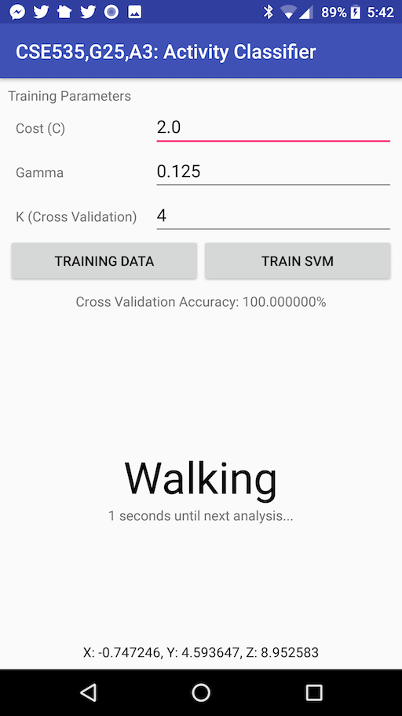
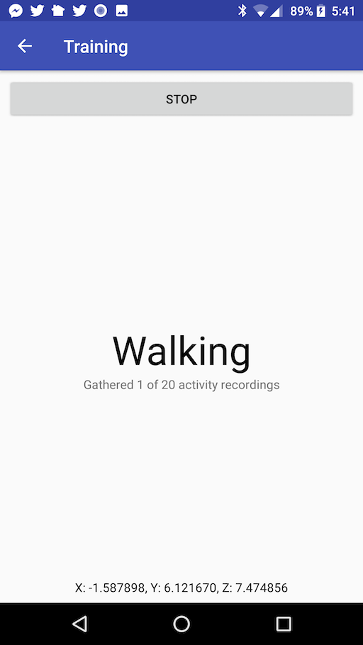

CSE535 Assignment 3
===================

Activity classification.

Main Screen
-----------
In the main screen you can adjust the hyperparams of the SVM and perform training. The data used for training are stored in an SQLite database at `/sdcard/Cse535_Group25/A3.db`. Default data are provided with the app, and the database will be created with this default data upon startup if there is not a database present already. After training the SVM, you can begin live classification so accelerometer data is collected and classified in real time.

Data Collection Activity
------------------------
A new database can be created with custom training data by clicking the "Training Data" button. You will be prompted to confirm deleting the old database and replace it with new data if that is the desired action.

Demo Video
------------------------

