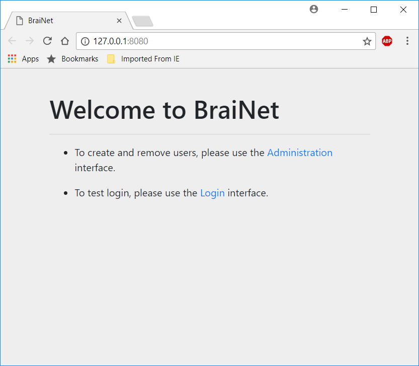
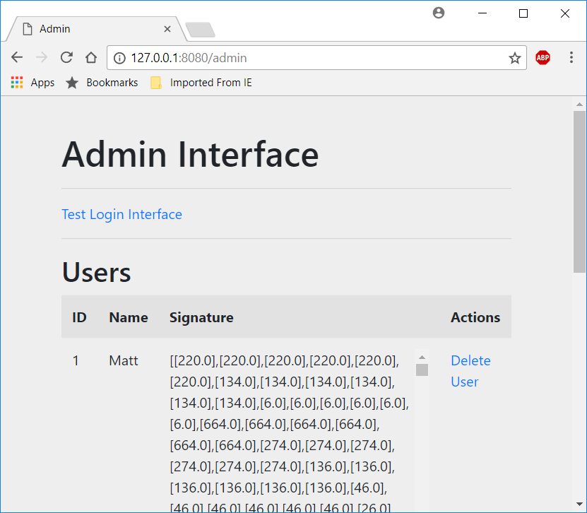
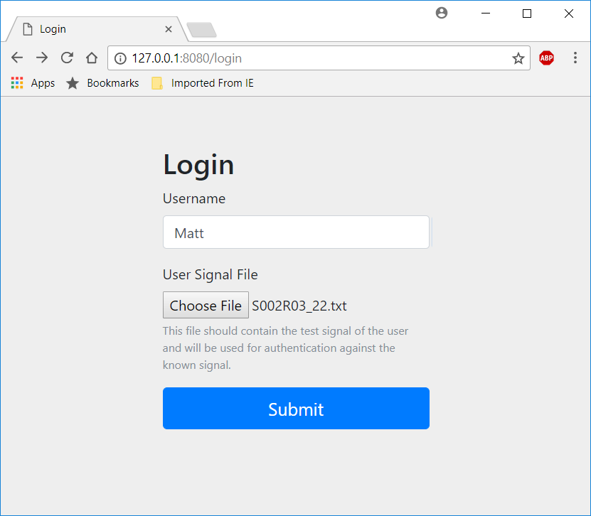

BraiNet Server
==============

This is the BraiNet server, which provides the user management and authentication system for the BraiNet project.

How it works
------------
There are two interfaces to the server portion of the system. The first is the administration interface, which allows you to add and remove users in the system. The next is the login interface, which allows users to authenticate with the system. Users are authenticated not by a password string as is common in other systems, but by their EEG signal data. The signal data is provided in the system by a text file containing 120 seconds of sample data collected at 160 Hz. A feature extraction is performed on the data to extract meaningfull characteristics from the signal. During authentication, features extracted from the signal provided at account creation are compared with the extracted feature data of the trial data provided at login. A special comparator is used to compare the two feature sets for a match. Users and their respective signal features are stored in a SQLite database that is updated by the server at runtime.

The login webpage portion of the server can be used for testing the system from a desktop machine, however, the real login will happen from the mobile device, which will send the data to the server via a network request.

Install MATLAB
--------------
You'll need to install MATLAB before running the server. MATLAB is used to
run the instructor provided files for feature extraction and comparator.
Fortunately, as an ASU student, you can download and install MATLAB for free.
Just go to: https://myapps.asu.edu/app/matlab-2017b-student-home-use-licensing.
Running the installer is easy, but installation itself takes quite a while.

Then install the matlab engine for Python:

	https://www.mathworks.com/help/matlab/matlab_external/install-the-matlab-engine-for-python.html

Setting up your virtual environment
-----------------------------------
As the server portion is written in Python, a virtual environment is encouraged
to neatly manage the server dependencies without disrupting the system. Follow
the steps below to create and install a virtual environment.

Install the virtualenv tool which is used to create the virtual environments:

	C:\Python27\Scripts\pip.exe install virtualenv

Create and activate environment:

	mkdir env
	C:\Python27\Scripts\virtualenv.exe --system-site-packages env
	env\Scripts\activate

Now the command prompt will have "(env)" before the usual prompt.

Install requirements
--------------------
There are a few Python packages that are used in the server. Dependencies can
be installed using pip.

	pip install -r requirements.txt

Starting the Server
-------------------
You can run the server using the `run.bat` Batch script, or you can start the
server manually via `python server.py`. If you have used a virtual environment
as described above, be sure to active the environment first.

You can now navigate to [http://127.0.0.1:8080](http://127.0.0.1:8080) to test the system.

Note that the administration interface is not guarded by any means of authentication, so anyone with access to the system via the network could potentially use the administration interface.

Screenshots
-----------

By navigating to the above link, you will be greeted with the index page, which has links to the admin and login interface.

The admin interface is pictured below. Each user in the system is listed. Users can be deleted by clicking the "Delete User" link.

Users can be created from the admin page by scrolling to the bottom and entering the user information in the form.

![Admin Interface]./(screenshots/screenshot_admin_2.png)

Users can login from the web by going to the login page, pictured below.

